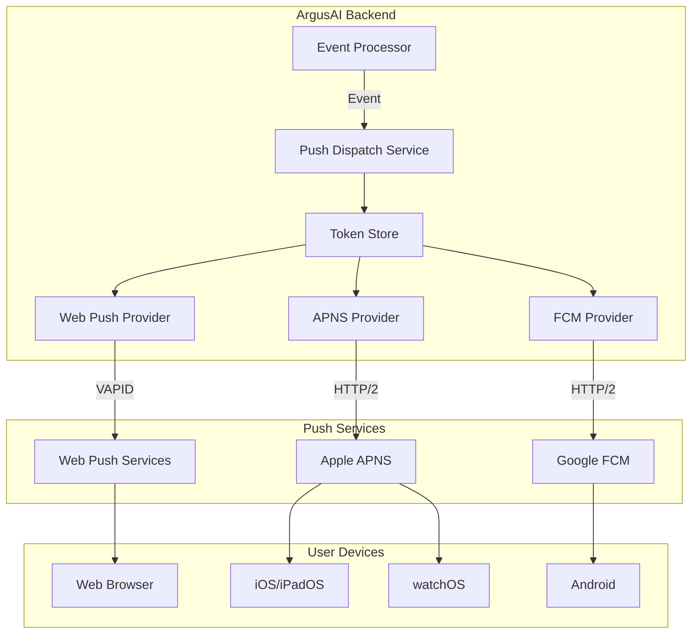
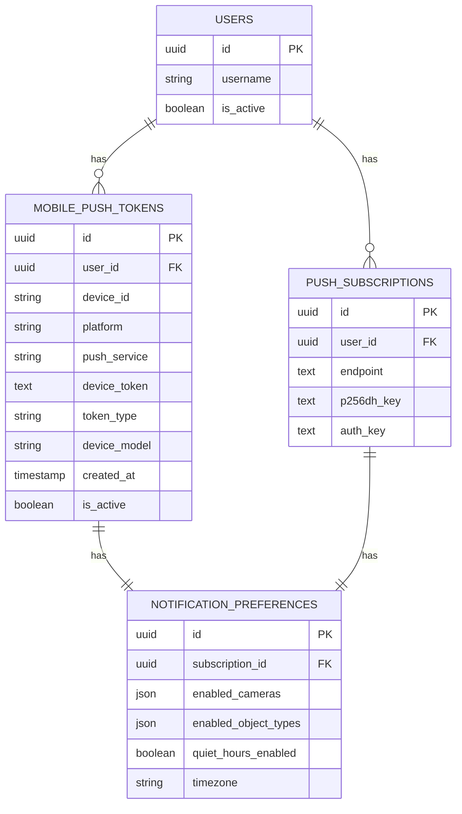
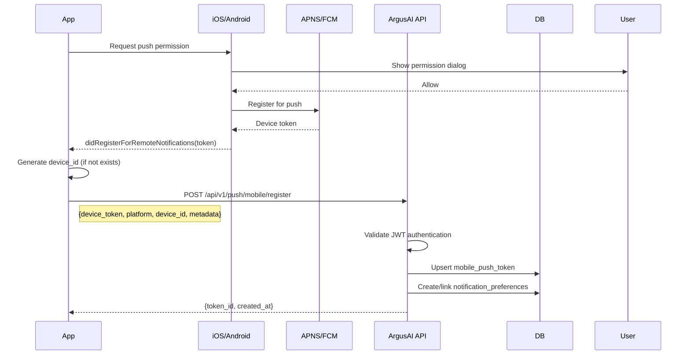
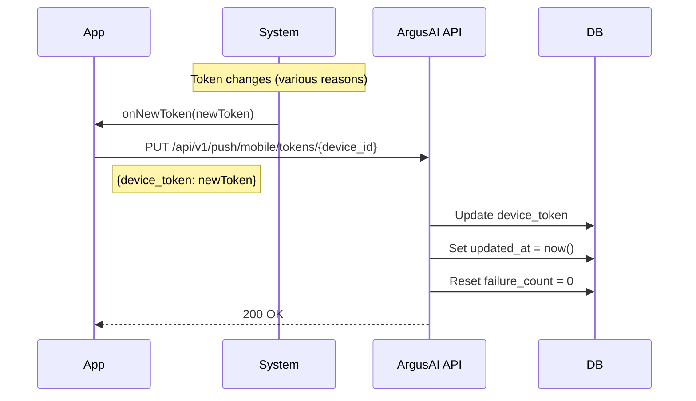
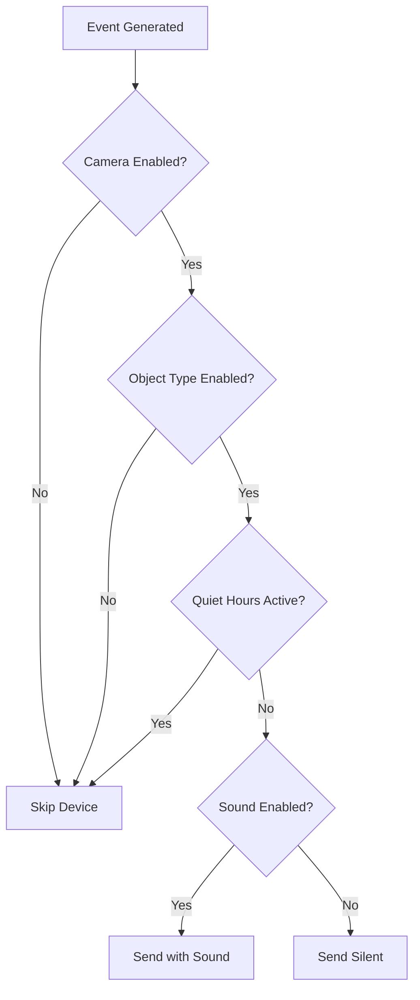
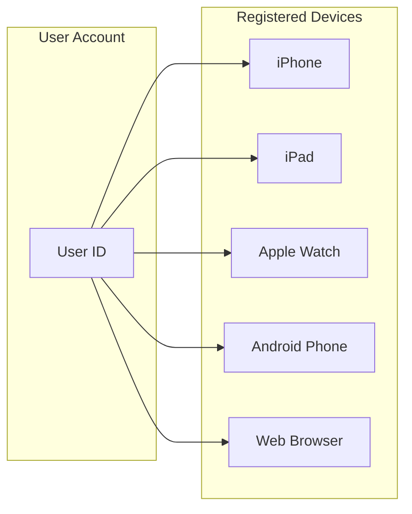
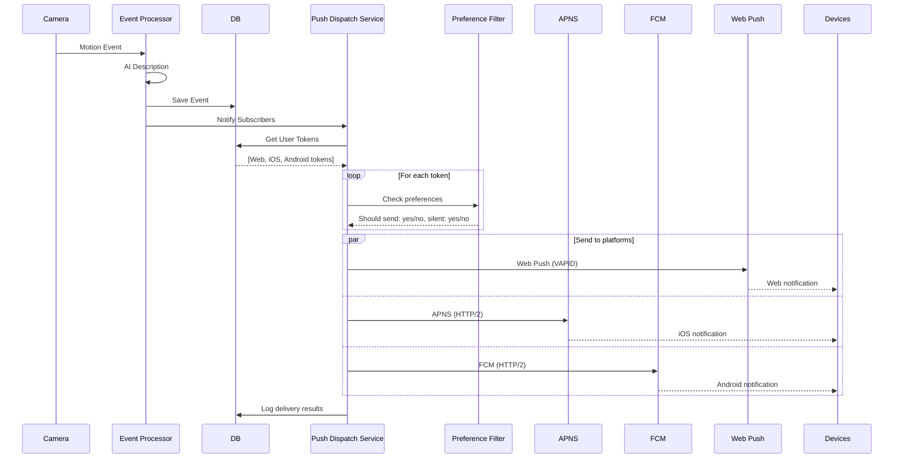
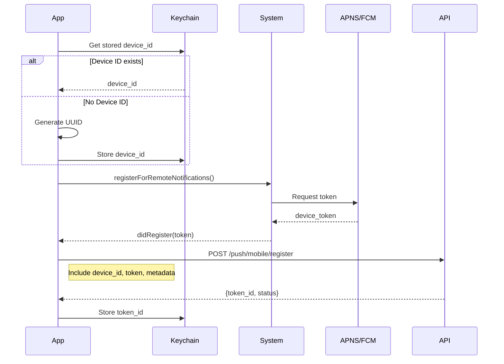

# Mobile Push Notification Architecture

**Version:** 1.0.0
**Last Updated:** 2025-12-25
**Story:** P10-5.4

This document defines the push notification architecture for mobile clients (iOS, iPadOS, watchOS, Android) connecting to ArgusAI.

---

## Table of Contents

1. [Overview](#overview)
2. [Platform Services](#platform-services)
3. [Device Token Storage Model](#device-token-storage-model)
4. [Token Registration Flow](#token-registration-flow)
5. [Notification Payload Structure](#notification-payload-structure)
6. [APNS Integration](#apns-integration)
7. [FCM Integration](#fcm-integration)
8. [Token Lifecycle Management](#token-lifecycle-management)
9. [Notification Preferences](#notification-preferences)
10. [Multi-Device Support](#multi-device-support)
11. [Sequence Diagrams](#sequence-diagrams)
12. [API Endpoints](#api-endpoints)
13. [Implementation Recommendations](#implementation-recommendations)
14. [Security Considerations](#security-considerations)

---

## Overview

ArgusAI supports push notifications across three platforms:

| Platform | Service | Protocol | Use Case |
|----------|---------|----------|----------|
| Web | Web Push | VAPID | Browser notifications (existing) |
| iOS/watchOS | APNS | HTTP/2 + TLS | Native Apple notifications |
| Android | FCM | HTTP/2 | Native Android notifications |

### Architecture Goals

1. **Unified Backend:** Single push service handling all platforms
2. **Platform Abstraction:** Common notification format with platform-specific adaptations
3. **Consistent Preferences:** Same filtering rules (camera, object type, quiet hours) across all devices
4. **Reliable Delivery:** Retry logic, token refresh, and failure handling
5. **Multi-Device:** Users can receive alerts on all their registered devices

### High-Level Architecture



---

## Platform Services

### Apple Push Notification Service (APNS)

APNS delivers notifications to Apple devices (iOS, iPadOS, watchOS, tvOS, macOS).

| Aspect | Details |
|--------|---------|
| Protocol | HTTP/2 over TLS 1.3 |
| Authentication | Token-based (.p8 key) or Certificate-based (.p12) |
| Payload Size | 4KB maximum |
| Connection | Persistent HTTP/2 connection pool |
| Environments | Sandbox (development), Production |

**Recommended: Token-Based Authentication (.p8)**
- Simpler key management (no certificate expiration)
- Single key works for all apps
- Key ID + Team ID + Bundle ID for routing

### Firebase Cloud Messaging (FCM)

FCM delivers notifications to Android devices and can proxy to APNS for iOS.

| Aspect | Details |
|--------|---------|
| Protocol | HTTP/2 or Legacy HTTP |
| Authentication | Service Account (OAuth 2.0) or Server Key |
| Payload Size | 4KB maximum |
| Message Types | Data messages (app-handled) or Notification messages (system) |
| Topics | Support for subscription-based broadcast |

**Recommendation:** Use FCM Data Messages for Android to have consistent app-controlled handling.

---

## Device Token Storage Model

### Database Schema

The mobile push token model extends the existing `PushSubscription` pattern with platform-specific fields.

```sql
CREATE TABLE mobile_push_tokens (
    id UUID PRIMARY KEY DEFAULT gen_random_uuid(),
    user_id UUID REFERENCES users(id) ON DELETE CASCADE,
    device_id VARCHAR(36) NOT NULL,

    -- Platform identification
    platform VARCHAR(20) NOT NULL,  -- 'ios', 'ipados', 'watchos', 'tvos', 'android'
    push_service VARCHAR(10) NOT NULL,  -- 'apns', 'fcm'

    -- Token data
    device_token TEXT NOT NULL,  -- Platform-specific token
    token_type VARCHAR(20) DEFAULT 'production',  -- 'sandbox' or 'production'

    -- Device metadata
    device_model VARCHAR(100),  -- e.g., 'iPhone15,3', 'Pixel 8'
    os_version VARCHAR(20),  -- e.g., 'iOS 18.0', 'Android 14'
    app_version VARCHAR(20),  -- ArgusAI app version
    app_bundle_id VARCHAR(100),  -- e.g., 'com.argusai.app'

    -- Timestamps
    created_at TIMESTAMPTZ NOT NULL DEFAULT NOW(),
    updated_at TIMESTAMPTZ NOT NULL DEFAULT NOW(),
    last_used_at TIMESTAMPTZ,

    -- Status
    is_active BOOLEAN DEFAULT TRUE,
    failure_count INT DEFAULT 0,
    last_failure_at TIMESTAMPTZ,
    last_failure_reason TEXT,

    -- Constraints
    UNIQUE(device_id, push_service),
    INDEX idx_mobile_push_user (user_id),
    INDEX idx_mobile_push_platform (platform, push_service),
    INDEX idx_mobile_push_active (is_active, user_id)
);
```

### Relationship Diagram



### Token Uniqueness Strategy

1. **Device Token Uniqueness:** The `device_token` is unique per device and push service
2. **Device ID Persistence:** Use device UUID that persists across app reinstalls (stored in Keychain/Keystore)
3. **Upsert Logic:** When registering a token, update if device_id + push_service exists
4. **User Association:** Tokens are linked to authenticated users for preference filtering

---

## Token Registration Flow

### Mobile Client Registration



### Registration Request Format

```json
{
  "device_token": "1234567890abcdef...",
  "platform": "ios",
  "push_service": "apns",
  "token_type": "production",
  "device_id": "550e8400-e29b-41d4-a716-446655440000",
  "device_model": "iPhone15,3",
  "os_version": "iOS 18.0",
  "app_version": "1.0.0",
  "app_bundle_id": "com.argusai.app"
}
```

### Registration Response

```json
{
  "id": "660e8400-e29b-41d4-a716-446655440001",
  "device_id": "550e8400-e29b-41d4-a716-446655440000",
  "platform": "ios",
  "push_service": "apns",
  "created_at": "2025-12-25T10:30:00Z",
  "preferences_created": true
}
```

---

## Notification Payload Structure

### Unified ArgusAI Payload

All platforms use the same internal notification structure before platform-specific adaptation:

```json
{
  "title": "Front Door: Person Detected",
  "body": "A person was detected at the front door at 10:30 AM",
  "event_id": "evt-123456",
  "camera_id": "cam-789",
  "camera_name": "Front Door",
  "smart_detection_type": "person",
  "thumbnail_url": "/api/v1/events/evt-123456/thumbnail",
  "url": "/events?highlight=evt-123456",
  "timestamp": "2025-12-25T10:30:00Z",
  "actions": [
    {"id": "view", "title": "View"},
    {"id": "dismiss", "title": "Dismiss"}
  ],
  "category": "SECURITY_ALERT",
  "sound": "default",
  "priority": "high"
}
```

### APNS Payload Adaptation

APNS requires the `aps` dictionary wrapper:

```json
{
  "aps": {
    "alert": {
      "title": "Front Door: Person Detected",
      "body": "A person was detected at the front door at 10:30 AM",
      "subtitle": "Front Door Camera"
    },
    "badge": 1,
    "sound": "default",
    "mutable-content": 1,
    "category": "SECURITY_ALERT",
    "thread-id": "cam-789"
  },
  "event_id": "evt-123456",
  "camera_id": "cam-789",
  "camera_name": "Front Door",
  "smart_detection_type": "person",
  "thumbnail_url": "https://argusai.local/api/v1/events/evt-123456/thumbnail",
  "url": "/events?highlight=evt-123456"
}
```

**Key APNS Fields:**

| Field | Purpose |
|-------|---------|
| `mutable-content` | Enables Notification Service Extension for thumbnail download |
| `category` | Links to UNNotificationCategory for action buttons |
| `thread-id` | Groups notifications by camera for collapse |
| `badge` | App icon badge count |

### FCM Payload Adaptation

FCM uses data messages for app-controlled display:

```json
{
  "message": {
    "token": "device_token_here",
    "data": {
      "title": "Front Door: Person Detected",
      "body": "A person was detected at the front door at 10:30 AM",
      "event_id": "evt-123456",
      "camera_id": "cam-789",
      "camera_name": "Front Door",
      "smart_detection_type": "person",
      "thumbnail_url": "https://argusai.local/api/v1/events/evt-123456/thumbnail",
      "url": "/events?highlight=evt-123456",
      "click_action": "OPEN_EVENT",
      "notification_channel": "security_alerts"
    },
    "android": {
      "priority": "high",
      "ttl": "86400s",
      "notification": {
        "channel_id": "security_alerts",
        "icon": "ic_notification",
        "color": "#FF5722",
        "tag": "cam-789"
      }
    }
  }
}
```

**Key FCM Fields:**

| Field | Purpose |
|-------|---------|
| `priority: high` | Wake device immediately for security alerts |
| `ttl` | Time-to-live for offline devices |
| `channel_id` | Android notification channel (requires setup) |
| `tag` | Collapse key for grouping by camera |

### Thumbnail Handling for Rich Notifications

Both platforms support rich notifications with images:

**iOS (Notification Service Extension):**
1. App includes a Notification Service Extension target
2. Extension receives notification with `mutable-content: 1`
3. Extension downloads thumbnail from `thumbnail_url`
4. Extension attaches image as `UNNotificationAttachment`
5. Modified notification displays with thumbnail

**Android (FirebaseMessagingService):**
1. App receives data message in `onMessageReceived`
2. App downloads thumbnail bitmap from `thumbnail_url`
3. App builds notification with `.setStyle(BigPictureStyle().bigPicture(bitmap))`
4. Notification displays with large image

---

## APNS Integration

### Authentication Setup

ArgusAI uses **Token-Based Authentication** with an APNS Auth Key (.p8 file).

**Requirements:**

1. **Apple Developer Account** with Push Notification capability
2. **APNS Auth Key (.p8 file)** from Apple Developer Portal
3. **Key ID** (10-character string)
4. **Team ID** (10-character string)
5. **Bundle ID** (e.g., `com.argusai.app`)

### Environment Variables

```env
# APNS Configuration
APNS_KEY_FILE=data/apns/AuthKey_XXXXXXXXXX.p8
APNS_KEY_ID=XXXXXXXXXX
APNS_TEAM_ID=YYYYYYYYYY
APNS_BUNDLE_ID=com.argusai.app
APNS_USE_SANDBOX=false  # true for development
```

### APNS Provider Service

```python
# Conceptual structure (not implementation)
class APNSProvider:
    """
    APNS notification provider using HTTP/2.

    Uses token-based authentication (JWT) with the .p8 key.
    Maintains persistent HTTP/2 connection pool.
    """

    SANDBOX_HOST = "api.sandbox.push.apple.com"
    PRODUCTION_HOST = "api.push.apple.com"

    def __init__(self, key_file, key_id, team_id, bundle_id, sandbox=False):
        self.host = self.SANDBOX_HOST if sandbox else self.PRODUCTION_HOST
        # Load .p8 key and configure JWT signing

    def generate_auth_token(self) -> str:
        """Generate JWT for APNS authentication (valid for 1 hour)."""
        # JWT with ES256 algorithm, kid=key_id, iss=team_id

    async def send(self, device_token: str, payload: dict) -> APNSResult:
        """Send notification to single device."""
        # POST /3/device/{device_token}
        # Headers: authorization, apns-topic, apns-push-type, apns-priority
```

### APNS Response Handling

| Status | Meaning | Action |
|--------|---------|--------|
| 200 | Success | Update last_used_at |
| 400 | Bad request | Log error, review payload |
| 403 | Certificate/token issue | Check auth configuration |
| 410 | Token unregistered | Delete token from database |
| 429 | Too many requests | Implement backoff |
| 500+ | APNS server error | Retry with backoff |

### Sandbox vs Production

| Environment | When to Use | APNS Host |
|-------------|-------------|-----------|
| Sandbox | Development builds, TestFlight | api.sandbox.push.apple.com |
| Production | App Store releases | api.push.apple.com |

**Detection:** Apps register with `token_type: "sandbox"` or `"production"` based on build configuration.

---

## FCM Integration

### Firebase Project Setup

**Requirements:**

1. **Firebase Project** with Cloud Messaging enabled
2. **Service Account JSON** file for server authentication
3. **google-services.json** (Android) or **GoogleService-Info.plist** (iOS via FCM)

### Environment Variables

```env
# FCM Configuration
GOOGLE_APPLICATION_CREDENTIALS=data/firebase/service-account.json
FCM_PROJECT_ID=argusai-12345
```

### FCM Provider Service

```python
# Conceptual structure (not implementation)
class FCMProvider:
    """
    FCM notification provider using HTTP/2 API.

    Uses service account credentials for authentication.
    Supports data messages and notification messages.
    """

    FCM_ENDPOINT = "https://fcm.googleapis.com/v1/projects/{project_id}/messages:send"

    def __init__(self, credentials_file, project_id):
        # Load service account and get OAuth token

    async def send(self, device_token: str, payload: dict) -> FCMResult:
        """Send notification to single device."""
        # POST with OAuth Bearer token
```

### FCM Response Handling

| Error Code | Meaning | Action |
|------------|---------|--------|
| UNREGISTERED | Token no longer valid | Delete token |
| INVALID_ARGUMENT | Malformed request | Review payload |
| SENDER_ID_MISMATCH | Wrong sender | Check Firebase config |
| QUOTA_EXCEEDED | Rate limited | Implement backoff |
| UNAVAILABLE | FCM server down | Retry with backoff |
| INTERNAL | FCM error | Retry with backoff |

### FCM Token Refresh

Android devices may get new tokens. Handle via `onNewToken`:

```kotlin
class MyFirebaseService : FirebaseMessagingService() {
    override fun onNewToken(token: String) {
        // Send new token to ArgusAI server
        api.updatePushToken(token)
    }
}
```

---

## Token Lifecycle Management

### Token Refresh Flow



### Token Invalidation Scenarios

| Scenario | Detection | Action |
|----------|-----------|--------|
| App uninstalled | APNS 410 / FCM UNREGISTERED | Delete token |
| Token refreshed | App reports new token | Update existing record |
| User logs out | App calls unregister | Mark inactive or delete |
| Device replaced | No response + new device registers | Old token eventually fails |
| Account deleted | Backend deletes user | Cascade delete tokens |

### Failure Tracking

```python
# On send failure (not 410/UNREGISTERED)
token.failure_count += 1
token.last_failure_at = datetime.now()
token.last_failure_reason = error_message

# Deactivate after persistent failures
if token.failure_count >= 5:
    token.is_active = False
```

### Token Cleanup Job

Run periodically (e.g., daily) to clean stale tokens:

```python
# Cleanup criteria:
# - Inactive tokens older than 30 days
# - Tokens with 5+ failures and no success in 7 days
# - Tokens not used in 90 days (optional, configurable)
```

---

## Notification Preferences

### Per-Device Preferences

Mobile tokens use the same `NotificationPreference` model as web push:

```python
class NotificationPreference:
    subscription_id: str  # Links to mobile_push_token.id
    enabled_cameras: List[str]  # null = all cameras
    enabled_object_types: List[str]  # null = all types
    quiet_hours_enabled: bool
    quiet_hours_start: str  # "HH:MM"
    quiet_hours_end: str  # "HH:MM"
    timezone: str  # IANA timezone
    sound_enabled: bool
```

### Preference Filtering Flow

Before sending to each device:



### Cross-Platform Preference API

The existing preference endpoints work for mobile tokens:

```
POST /api/v1/push/mobile/preferences
PUT /api/v1/push/mobile/preferences
```

Request format:
```json
{
  "device_id": "550e8400-e29b-41d4-a716-446655440000",
  "enabled_cameras": ["cam-123", "cam-456"],
  "enabled_object_types": ["person", "vehicle"],
  "quiet_hours_enabled": true,
  "quiet_hours_start": "22:00",
  "quiet_hours_end": "07:00",
  "timezone": "America/New_York",
  "sound_enabled": true
}
```

---

## Multi-Device Support

### User Device Registry

Each user can have multiple devices registered:



### Broadcasting to All Devices

When an event occurs:

1. Query all active tokens for the user
2. Apply per-device preference filtering
3. Send to each platform provider in parallel
4. Track delivery results per device

```python
async def notify_user_devices(user_id: str, event: Event):
    # Get all active tokens for user
    web_subs = get_web_subscriptions(user_id)
    mobile_tokens = get_mobile_tokens(user_id)

    # Build platform-specific payloads
    base_notification = format_rich_notification(event)

    # Send in parallel
    results = await asyncio.gather(
        send_web_push(web_subs, base_notification),
        send_apns(apns_tokens, adapt_for_apns(base_notification)),
        send_fcm(fcm_tokens, adapt_for_fcm(base_notification)),
    )
```

### Device Management UI

Users should be able to:

1. View registered devices (`GET /api/v1/devices`)
2. Rename devices for identification
3. Revoke device access (`DELETE /api/v1/devices/{id}`)
4. Configure per-device preferences

---

## Sequence Diagrams

### Complete Event-to-Notification Flow



### Token Registration on App Launch



---

## API Endpoints

### Mobile Token Registration

**Endpoint:** `POST /api/v1/push/mobile/register`

**Headers:**
```
Authorization: Bearer <jwt_token>
Content-Type: application/json
```

**Request:**
```json
{
  "device_token": "abc123...",
  "platform": "ios",
  "push_service": "apns",
  "token_type": "production",
  "device_id": "550e8400-e29b-41d4-a716-446655440000",
  "device_model": "iPhone15,3",
  "os_version": "iOS 18.0",
  "app_version": "1.0.0",
  "app_bundle_id": "com.argusai.app"
}
```

**Response (201 Created):**
```json
{
  "id": "660e8400-e29b-41d4-a716-446655440001",
  "device_id": "550e8400-e29b-41d4-a716-446655440000",
  "platform": "ios",
  "push_service": "apns",
  "created_at": "2025-12-25T10:30:00Z",
  "preferences_created": true
}
```

### Update Token

**Endpoint:** `PUT /api/v1/push/mobile/tokens/{device_id}`

**Request:**
```json
{
  "device_token": "new_token_xyz..."
}
```

**Response (200 OK):**
```json
{
  "id": "660e8400-e29b-41d4-a716-446655440001",
  "device_token_updated": true,
  "updated_at": "2025-12-25T14:00:00Z"
}
```

### Unregister Token

**Endpoint:** `DELETE /api/v1/push/mobile/tokens/{device_id}`

**Response:** 204 No Content

### Get/Update Preferences

**Endpoint:** `POST /api/v1/push/mobile/preferences`

**Request:**
```json
{
  "device_id": "550e8400-e29b-41d4-a716-446655440000"
}
```

**Response:**
```json
{
  "id": "preference-uuid",
  "token_id": "token-uuid",
  "enabled_cameras": null,
  "enabled_object_types": ["person", "vehicle"],
  "quiet_hours_enabled": true,
  "quiet_hours_start": "22:00",
  "quiet_hours_end": "07:00",
  "timezone": "America/New_York",
  "sound_enabled": true
}
```

**Endpoint:** `PUT /api/v1/push/mobile/preferences`

Same request/response format with updated fields.

---

## Implementation Recommendations

### Python Libraries

| Library | Purpose | Recommendation |
|---------|---------|----------------|
| `aioapns` | Async APNS client | Preferred for APNS |
| `apns2` | Sync APNS client | Alternative |
| `firebase-admin` | Official FCM SDK | Recommended for FCM |

### Backend Service Structure

```
backend/app/services/
├── push_notification_service.py  # Existing web push
├── mobile_push_service.py        # Mobile coordinator
├── apns_provider.py              # APNS client
└── fcm_provider.py               # FCM client
```

### Mobile App Implementation

**iOS/Swift:**
- Use `UIApplication.shared.registerForRemoteNotifications()`
- Implement `UNNotificationServiceExtension` for thumbnails
- Define `UNNotificationCategory` for actions
- Store device_id in Keychain for persistence

**Android/Kotlin:**
- Use Firebase Cloud Messaging SDK
- Extend `FirebaseMessagingService`
- Handle `onNewToken` for token refresh
- Create notification channels for Android 8+

### Error Handling

1. **Retry with exponential backoff** for transient failures
2. **Remove token immediately** on 410/UNREGISTERED
3. **Log but don't delete** on other failures (may be temporary)
4. **Alert on repeated failures** to catch configuration issues

---

## Security Considerations

### Token Storage

| Platform | Secure Storage |
|----------|----------------|
| iOS | Keychain with `kSecAttrAccessibleAfterFirstUnlock` |
| Android | EncryptedSharedPreferences or Keystore |
| Backend | Encrypted at rest, never logged |

### Authentication

- All mobile registration endpoints require JWT authentication
- Tokens are associated with authenticated user IDs
- Users can only manage their own tokens

### Transport Security

- APNS: TLS 1.3 to Apple servers
- FCM: TLS to Google servers
- ArgusAI API: HTTPS required for mobile clients

### Token Validation

- Validate device_id format (UUID)
- Validate platform values (whitelist)
- Sanitize device_token (hex or base64 only)
- Rate limit registration requests

---

## Related Documentation

- [Mobile Authentication Flow](./mobile-auth-flow.md) - JWT auth, device registration, biometric
- [Cloud Relay Architecture](../architecture/cloud-relay-architecture.md) - Remote access, device pairing
- [Push API Reference](./push.py) - Existing web push endpoints

---

## Changelog

| Version | Date | Changes |
|---------|------|---------|
| 1.0.0 | 2025-12-25 | Initial architecture documentation (Story P10-5.4) |
